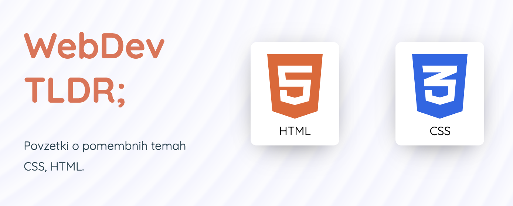

# WebDev TLDR;

An educational website with short, explanatory & interactive code examples. 

Made with [React.js](https://reactjs.org/) (UI framework) and [Next.js](https://nextjs.org/) (React.js framework for Server Side Rendering).

## Setup

To run this all locally, you need to have Node.js installed on your machine.

1. Install [Node.js](https://nodejs.org/en/)
2. Install [Yarn](https://classic.yarnpkg.com/en/docs/install/) (optional)
3. Clone this repo `git clone https://github.com/bartolomej/webdev-tldr && cd webdev-tldr`
4. Install dependencies `yarn install` or `npm i`
5. Run the app in development mode `yarn run dev` or `npm run dev`

## Contribute

To contribute, create a new branch prefixed with the issue id (if the issue exists), and a short explanatory description (e.g. `2_code_prettify`).

Commit all the changes in this branch and [create a Pull Request](https://docs.github.com/en/github/collaborating-with-issues-and-pull-requests/creating-a-pull-request).

All the changed committed to the `main` branch will be automatically deployed to [Vercel](https://vercel.com/).
